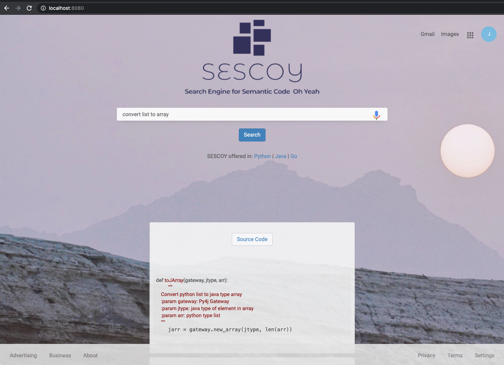

# SESCOY: Semantic Code Search Engine Oh Yeah[](https://circleci.com/gh/CircleCI-Public/circleci-demo-java-spring)

This is my course project for Agile Engineering 2020 at U.C. Berkeley. SESCOY is a code search engine which takes a input query and returns corresponding code snippets.

This application uses the following tools:

* Gradle
* Java 11
* PostgreSQL
* Spring Boot
* Thymeleaf
* Lucene

This project is build upon the [CircleCI tutorial](https://github.com/CircleCI-Public/circleci-demo-java-spring), and the dataset comes from [CodeSearchNet](https://github.com/github/CodeSearchNet). The logo is generated and modified with [WIX](https://www.wix.com/).

## Local Development

### Starting the application
```
./gradlew build
./gradlew bootRunDev
```
Navigate to http://localhost:8080




## License
Copyright © 2020 Changran Hu
Copyright © 2019 CircleCI

Distributed under the MIT license, see the file LICENSE.
